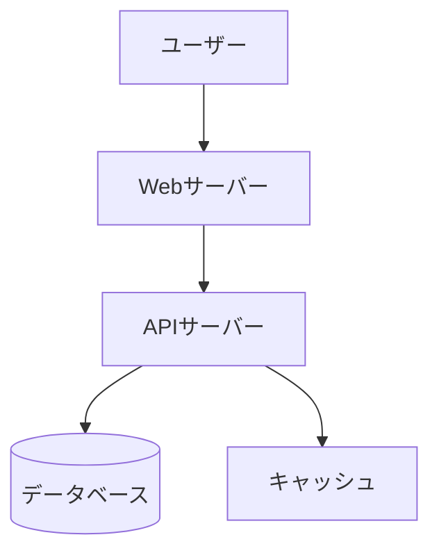

# marhup

Markdownからグリッドベースのレイアウトで PowerPoint (PPTX) を生成するCLIツール

## 特徴

- 📐 **グリッドベースレイアウト** - 設定可能なグリッド（デフォルト12×9）で直感的な位置指定
- 🎯 **シンプルな記法** - 位置指定は省略可能、自動レイアウト
- 🎨 **スタイル指定** - クラスベースの柔軟なスタイリング
- 🎬 **アニメーション対応** - PowerPointアニメーションの指定が可能（`{animation=fadein}` など）
- 🎭 **スライド遷移** - スライド間の遷移効果を指定可能
- 📝 **Markdown完全互換** - 標準Markdown記法をそのまま使用
- 🧩 **Mermaid対応** - Mermaid記法の図を自動で画像化
- 🎥 **動画埋め込み対応** - PowerPointに動画を埋め込み可能
- 🔌 **プラグイン拡張** - カスタム機能の追加が可能

## プラグイン

marhupはプラグインアーキテクチャをサポートしており、独自の要素タイプや機能を追加できます。

### プラグインの使用

```bash
# プラグインディレクトリを指定
marhup input.md -o output.pptx --plugin-dir ./plugins
```

### プラグインの作成

プラグインはJavaScriptまたはTypeScriptファイルとして作成します。以下はカスタム要素を追加する例：

```javascript
// plugins/custom-box.js
import type { Plugin } from 'marhup';

const plugin = {
  name: 'custom-box',
  version: '1.0.0',
  elementParsers: {
    paragraph: (token, aliases) => {
      const text = token.text || '';
      const match = text.match(/^:::custombox\s+(.+?)\s*:::$/);
      if (match) {
        return {
          type: 'custombox',
          content: match[1],
        };
      }
      return null;
    },
  },
  elementGenerators: {
    custombox: async (element, slide, context) => {
      slide.addText(element.content, {
        x: context.coords.x,
        y: context.coords.y,
        w: context.coords.w,
        h: context.coords.h,
        fill: { color: 'FFFF00' }, // Yellow background
      });
      return [];
    },
  },
};

export default plugin;
```

詳細なAPIドキュメントは[プラグイン開発ガイド](docs/plugins.md)を参照してください。

## インストール

```bash
npm install -g marhup
```

## 基本的な使い方

```bash
# 基本的な変換
marhup input.md -o output.pptx

# テーマを指定
marhup input.md -o output.pptx --theme corporate

# 監視モード（変更時に自動再生成）
marhup input.md -o output.pptx --watch
```

## ログ出力

marhupは詳細なログ出力を提供し、デバッグやトラブルシューティングを支援します：

```bash
# デフォルト（infoレベル）
marhup input.md -o output.pptx

# 詳細ログ（debugレベル）
LOG_LEVEL=debug marhup input.md -o output.pptx

# 最小ログ（errorのみ）
LOG_LEVEL=error marhup input.md -o output.pptx

# ログをファイルに出力
LOG_FILE=marhup.log marhup input.md -o output.pptx
```

ログレベル：
- `error`: エラーのみ
- `warn`: 警告以上
- `info`: 情報メッセージ（デフォルト）
- `debug`: デバッグ情報
- `trace`: 詳細トレース

## 記法ガイド

### スライドの区切り

`---` でスライドを区切ります：

```markdown
# スライド1

内容...

---

# スライド2

内容...
```

### Front Matter

各スライドの先頭でオプションを指定できます：

```markdown
---
title: プレゼンテーション
grid: 12x9
theme: default
aliases:
  title: "[1-12, 1]"
  contents: "[1-12, 2-8]"
  left: "[1-6, 2-8]"
  right: "[7-12, 2-8]"
---
```

または、テーマをカスタマイズ：

```markdown
---
title: プレゼンテーション
theme:
  fonts:
    title: "Times New Roman"
    body: "Georgia"
    code: "Consolas"
  colors:
    primary: "#ff6b6b"
    text: "#2c3e50"
---
```

| プロパティ | 説明 | デフォルト |
|-----------|------|-----------|
| `title` | ドキュメントタイトル | なし |
| `grid` | グリッドサイズ（列x行） | `12x9` |
| `theme` | テーマ名またはテーマ設定オブジェクト | `default` |
| `layout` | プリセットレイアウト | なし |
| `aliases` | グリッド位置の別名定義 | なし |
| `classes` | カスタムスタイルクラス | なし |

### グリッド位置指定

`[列, 行]` 形式または定義した別名で要素の位置を指定します：

```markdown
# タイトル [1-12, 1]
# タイトル [title]  # 別名使用

[1-6, 2-8]
左側のコンテンツ

[7-12, 2-8]
右側のコンテンツ

[contents]  # 別名使用
中央のコンテンツ
```

#### 記法

| 記法 | 説明 | 例 |
|------|------|-----|
| `[列, 行]` | 1セル | `[1, 1]` |
| `[列1-列2, 行]` | 列の範囲 | `[1-6, 1]` |
| `[列, 行1-行2]` | 行の範囲 | `[1, 1-3]` |
| `[列1-列2, 行1-行2]` | 矩形範囲 | `[1-6, 2-8]` |

#### グリッドイメージ

```
     1   2   3   4   5   6   7   8   9  10  11  12
   ┌───┬───┬───┬───┬───┬───┬───┬───┬───┬───┬───┬───┐
 1 │                     [1-12, 1]                  │
   ├───┴───┴───┬───┴───┴───┴───┴───┴───┼───┴───┴───┤
 2 │           │                       │           │
 3 │  [1-3,    │      [4-9, 2-5]       │ [10-12,   │
 4 │   2-5]    │                       │   2-5]    │
 5 │           │                       │           │
   ├───────────┴───────────────────────┴───────────┤
 6 │                                               │
 7 │                  [1-12, 6-9]                  │
 8 │                                               │
 9 │                                               │
   └───────────────────────────────────────────────┘
```

### スタイル指定

`{.クラス名}` 形式でスタイルを指定します：

```markdown
# タイトル [1-12, 1] {.center}

テキスト {.red .bold}
```

#### 利用可能なクラス

| カテゴリ | クラス | 説明 |
|---------|--------|------|
| 配置 | `.center` | 中央揃え |
| | `.left` | 左揃え |
| | `.right` | 右揃え |
| 文字色 | `.red` | 赤色 |
| | `.blue` | 青色 |
| | `.green` | 緑色 |
| | `.gray` | グレー |
| | `.orange` | オレンジ色 |
| | `.purple` | 紫色 |
| 背景色 | `.bg-red` | 薄い赤背景 |
| | `.bg-blue` | 薄い青背景 |
| | `.bg-green` | 薄い緑背景 |
| | `.bg-gray` | 薄い灰背景 |
| サイズ | `.small` | 小さいフォント |
| | `.large` | 大きいフォント |
| 装飾 | `.bold` | 太字 |
| | `.highlight` | ハイライト背景 |
| | `.card` | カード風背景 |
| 特殊 | `.header` | ヘッダー領域 |
| | `.footer` | フッター領域 |
| | `.note` | 注釈スタイル |

**カスタムクラス**: Front Matterで独自のスタイルクラスを定義できます。定義したクラスはMarkdown内で使用可能です。

```markdown
---
classes:
  myclass:
    color: '#ff0000'
    bold: true
    fill: { color: '#ffe6e6' }
---

# タイトル {.myclass}
```

### 省略時のデフォルト動作

位置やスタイルは省略可能です：

```markdown
# タイトル

本文テキスト

- 箇条書き1
- 箇条書き2
```

| 省略した場合 | デフォルト動作 |
|------------|---------------|
| `grid:` | `12x9` を使用 |
| `[位置]` | 上から順に自動配置、全幅 |
| `{スタイル}` | テーマのデフォルト |

### アニメーション指定

`{animation=タイプ}` 形式でPowerPointアニメーションを指定できます：

```markdown
# タイトル {animation=appear}

テキスト {animation=fade animation-delay=1}

 {animation=zoom animation-direction=left}

!v[動画](video.mp4) {animation=appear}
```

#### アニメーションタイプ

| タイプ | 説明 |
|--------|------|
| `appear` | 出現 |
| `fade` | フェードイン/アウト |
| `fly` | 飛んで入る |
| `zoom` | ズーム |
| `wipe` | ワイプ |
| `split` | 分割 |
| `wheel` | 車輪 |
| `randomBars` | ランダムバー |
| `growShrink` | 拡大縮小 |
| `spin` | 回転 |
| `float` | 浮遊 |
| `shape` | シェイプ |
| `bounce` | バウンス |
| `pulse` | パルス |
| `teeter` | 揺れ |
| `blink` | 点滅 |
| `flicker` | ちらつき |
| `swivel` | 旋回 |
| `spring` | スプリング |

#### アニメーションオプション

| オプション | 説明 | 例 |
|-----------|------|-----|
| `animation-delay` | 遅延時間（秒） | `animation-delay=2` |
| `animation-duration` | 継続時間（秒） | `animation-duration=1.5` |
| `animation-direction` | 方向 | `animation-direction=left` |
| `animation-trigger` | トリガー | `animation-trigger=onClick` |
| `animation-repeat` | 繰り返し回数 | `animation-repeat=3` |
| `animation-speed` | 速度 | `animation-speed=fast` |

### スライド遷移

スライドごとに遷移効果を指定できます：

```markdown
---
title: プレゼンテーション
---

# スライド1

通常のスライド

---

# スライド2
transition:
  type: fade
  duration: 1
  speed: medium

フェードイン効果のスライド

---

# スライド3
transition:
  type: push
  direction: left
  duration: 0.5

左から押し出す効果のスライド
```

#### 遷移タイプ

| タイプ | 説明 |
|--------|------|
| `none` | 遷移なし |
| `fade` | フェード |
| `push` | 押し出し |
| `wipe` | ワイプ |
| `split` | 分割 |
| `reveal` | 現れる |
| `randomBars` | ランダムバー |
| `shape` | シェイプ |
| `uncover` | アンカバー |
| `cover` | カバー |
| `flash` | フラッシュ |
| `checker` | チェッカー |
| `blinds` | ブラインド |
| `clock` | 時計 |
| `ripple` | リップル |
| `honeycomb` | ハニカム |
| `glitter` | グリッター |
| `sphere` | スフィア |
| `newsflash` | ニュースフラッシュ |
| `plus` | プラス |
| `diamond` | ダイヤモンド |
| `wedge` | ウェッジ |
| `wheel` | 車輪 |
| `circle` | 円 |
| `box` | ボックス |
| `zoom` | ズーム |
| `dissolve` | 溶解 |

#### 遷移オプション

| オプション | 説明 | 例 |
|-----------|------|-----|
| `type` | 遷移タイプ | `type: fade` |
| `duration` | 継続時間（秒） | `duration: 1` |
| `direction` | 方向 | `direction: left` |
| `speed` | 速度 | `speed: medium` |

## 高度な機能

### 高度なテーマカスタマイズ

marhupでは、Front Matterでテーマを詳細にカスタマイズできます。デフォルトテーマをベースに、色、フォント、フォントサイズ、グラデーションなどを上書きできます。

#### テーマ設定の構造

```yaml
---
theme:
  colors:
    primary: '#ff6b6b'      # メインカラー
    secondary: '#4ecdc4'    # セカンダリカラー
    accent: '#ffe66d'       # アクセントカラー
    background: '#ffffff'   # 背景色
    text: '#2c3e50'         # テキスト色
  fonts:
    title: 'Times New Roman'  # タイトルフォント
    body: 'Georgia'           # 本文フォント
    code: 'Consolas'          # コードフォント
  fontSize:
    h1: 44                    # H1サイズ
    h2: 32                    # H2サイズ
    h3: 28                    # H3サイズ
    body: 20                  # 本文サイズ
    small: 16                 # 小サイズ
  slideMaster:
    backgroundColor: '#ffffff'
    margin:
      top: 0.5
      bottom: 0.5
      left: 0.5
      right: 0.5
---
```

#### カラーテーマの例

```markdown
---
theme:
  colors:
    primary: '#e74c3c'    # 赤系
    secondary: '#95a5a6'  # グレー
    accent: '#f39c12'     # オレンジ
    background: '#ecf0f1' # ライトグレー
    text: '#2c3e50'       # ダーク
---

# 企業プレゼンテーション [1-12, 1]

[1-6, 2-8]
## 製品概要
{.primary}  <!-- プライマリカラーのテキスト -->

[7-12, 2-8]
## 特徴
- 高品質
- 信頼性
- 使いやすさ
```

#### フォントテーマの例

```markdown
---
theme:
  fonts:
    title: 'Arial Black'
    body: 'Arial'
    code: 'Courier New'
  fontSize:
    h1: 48
    h2: 36
    body: 24
---

# モダンスタイル [1-12, 1]

本文はArialフォントで大きめに表示されます。
```

### 高度なアニメーション

アニメーションは要素ごとに細かく制御できます。複数のオプションを組み合わせることで、プロフェッショナルなプレゼンテーションを作成できます。

#### アニメーションのタイミング制御

```markdown
# タイトル {animation=appear animation-delay=0}

## サブタイトル {animation=fade animation-delay=0.5}

- 項目1 {animation=fly animation-direction=left animation-delay=1}
- 項目2 {animation=fly animation-direction=left animation-delay=1.2}
- 項目3 {animation=fly animation-direction=left animation-delay=1.4}

 {animation=zoom animation-delay=2 animation-duration=1.5}
```

#### トリガーと繰り返し

```markdown
# クリックで開始 {animation=appear animation-trigger=onClick}

# 自動再生 {animation=spin animation-repeat=3 animation-speed=fast}

# 前の要素と同時 {animation=bounce animation-trigger=withPrevious}
```

#### 複雑なアニメーションシーケンス

```markdown
---
grid: 12x9
---

# ダッシュボード表示 [1-12, 1] {animation=appear}

[1-3, 2-4] {.card} {animation=fly animation-direction=left animation-delay=0.5}
### KPI 1
**100%**

[4-6, 2-4] {.card} {animation=fly animation-direction=top animation-delay=1}
### KPI 2
**85%**

[7-9, 2-4] {.card} {animation=zoom animation-delay=1.5}
### KPI 3
**92%**

[10-12, 2-4] {.card} {animation=bounce animation-delay=2}
### KPI 4
**78%**

[1-12, 5-9] {animation=fade animation-delay=2.5}

```

#### アニメーションの方向指定

```markdown
# 左から飛んでくる {animation=fly animation-direction=left}

# 右から {animation=fly animation-direction=right}

# 上から {animation=fly animation-direction=top}

# 対角線 {animation=fly animation-direction=topLeft}

# 回転方向 {animation=spin animation-direction=clockwise}
```

### カスタムスタイルクラスの活用

Front Matterで独自のスタイルクラスを定義し、再利用できます。

```markdown
---
classes:
  highlight-box:
    fill: { color: '#e3f2fd' }
    line: { color: '#2196f3', width: 2 }
    bold: true
    fontSize: 24
  warning:
    color: '#f57c00'
    fill: { color: '#fff3e0' }
    bold: true
  success:
    color: '#388e3c'
    fill: { color: '#e8f5e8' }
---

# プロジェクトステータス [1-12, 1]

[1-4, 2-4] {.highlight-box}
### 完了
- 設計
- 開発

[5-8, 2-4] {.warning}
### 進行中
- テスト
- ドキュメント

[9-12, 2-4] {.success}
### 予定
- リリース
- メンテナンス
```

## 完全なサンプル

### シンプルなスライド

```markdown
---
title: 月次報告
---

# 2026年1月 月次報告

営業部 山田太郎

---

# 今月の成果

- 新規顧客獲得: 15社
- 売上達成率: 120%
- 顧客満足度: 4.5/5.0
```

### グリッドレイアウト使用

```markdown
---
grid: 12x9
---

# 売上推移と分析 [1-12, 1]

[1-7, 2-8]


[8-12, 2-4]
## 好調要因
- 新製品のヒット
- リピート率向上

[8-12, 5-8]
## 課題
- 原価率の上昇
- 人材不足
```

### ダッシュボード風

```markdown
---
grid: 12x9
---

# KPIダッシュボード [1-12, 1]

[1-3, 2-4] {.card .blue}
### 売上
**¥128M**
前年比 +12%

[4-6, 2-4] {.card .green}
### 利益
**¥32M**
前年比 +8%

[7-9, 2-4] {.card .orange}
### 顧客数
**1,240社**
前年比 +15%

[10-12, 2-4] {.card}
### NPS
**72**
前年比 +5pt

[1-6, 5-9]


[7-12, 5-9]

```

### Mermaid図を含むスライド

````markdown
---
grid: 12x9
---

# システム構成図 [1-12, 1]

[1-6, 2-8]


[7-12, 2-5]
## アーキテクチャ
- Webサーバー: nginx
- API: Node.js
- DB: PostgreSQL

[7-12, 6-8]
### 特徴
- スケーラブル
- 高可用性
- セキュア
````

## CLIオプション

```
Usage: marhup [options] <input>

Markdownから PowerPoint を生成します

Arguments:
  input                    入力Markdownファイル

Options:
  -o, --output <file>      出力ファイル名 (default: "output.pptx")
  -t, --theme <name>       テーマ名 (default: "default")
  -w, --watch              監視モード
  --grid <size>            デフォルトグリッドサイズ (default: "12x9")
  -v, --version            バージョン表示
  -h, --help               ヘルプ表示
```

## プログラムからの使用

```typescript
import { marhup } from 'marhup';

const markdown = `
# タイトル

内容...
`;

await marhup(markdown, {
  output: 'output.pptx',
  theme: 'default'
});
```

## MCPサーバーとしての使用

marhupはModel Context Protocol (MCP) サーバーとして動作し、Claude Desktop等のAIアシスタントから直接呼び出すことができます。

### 提供されるツール

| ツール名 | 説明 |
|---------|------|
| `convert_markdown_to_pptx` | Markdownテキストから直接PPTXを生成 |
| `convert_file_to_pptx` | MarkdownファイルからPPTXを生成 |
| `get_marhup_guide` | marhup記法ガイドを取得 |

### Claude Desktopでの設定

`~/Library/Application Support/Claude/claude_desktop_config.json` に以下を追加:

```json
{
  "mcpServers": {
    "marhup": {
      "command": "node",
      "args": ["/path/to/marhup/dist/mcp.js"]
    }
  }
}
```

npmでグローバルインストールしている場合:

```json
{
  "mcpServers": {
    "marhup": {
      "command": "marhup-mcp"
    }
  }
}
```

### 使用例

AIアシスタントに以下のように依頼できます:

- 「このMarkdownをPowerPointに変換して」
- 「プレゼン資料を作成して、/path/to/output.pptx に保存して」
- 「marhupの記法を教えて」
- 「カスタムスタイルを使ってプレゼンを作成して」

#### カスタムクラスを使用した例

```markdown
---
classes:
  highlight:
    color: '#ff6b35'
    bold: true
    fill: { color: '#fff3cd' }
  note:
    fontSize: 12
    color: '#6c757d'
    italic: true
---

# プロジェクト概要 [1-12, 1]

[1-6, 2-8]
## 主な機能 {.highlight}
- 自動レイアウト
- スタイルカスタマイズ
- Mermaid図対応

[7-12, 2-8]
## 注意事項 {.note}
カスタムクラスはFront Matterで定義できます。
```

## 対応Markdown記法

| 記法 | 対応 |
|------|------|
| 見出し (`#`, `##`, ...) | ✅ |
| 段落 | ✅ |
| 箇条書き (`-`, `*`, `1.`) | ✅ |
| 画像 (``) | ✅ |
| 動画 (`!v(...)`) | ✅ |
| 表 | ✅ |
| コードブロック | ✅ |
| Mermaid図 (` ```mermaid `) | ✅ |
| 太字・斜体 | ✅ |
| リンク | ✅ |
| 引用 | ✅ |

## ライセンス

MIT

## 関連リンク

- [pptxgenjs](https://github.com/gitbrent/PptxGenJS) - PPTX生成ライブラリ
- [Marp](https://marp.app/) - 類似ツール（参考）
