# mashup

Markdownからグリッドベースのレイアウトで PowerPoint (PPTX) を生成するCLIツール

## 特徴

- 📐 **グリッドベースレイアウト** - 12×9グリッドで直感的な位置指定
- 🎯 **シンプルな記法** - 位置指定は省略可能、自動レイアウト
- 🎨 **スタイル指定** - クラスベースの柔軟なスタイリング
- 📝 **Markdown完全互換** - 標準Markdown記法をそのまま使用
- 🧩 **Mermaid対応** - Mermaid記法の図を自動で画像化

## インストール

```bash
npm install -g mashup
```

## 基本的な使い方

```bash
# 基本的な変換
mashup input.md -o output.pptx

# テーマを指定
mashup input.md -o output.pptx --theme corporate

# 監視モード（変更時に自動再生成）
mashup input.md -o output.pptx --watch
```

## 記法ガイド

### スライドの区切り

`---` でスライドを区切ります：

```markdown
# スライド1

内容...

---

# スライド2

内容...
```

### Front Matter

各スライドの先頭でオプションを指定できます：

```markdown
---
title: プレゼンテーション
grid: 12x9
theme: default
---
```

| プロパティ | 説明 | デフォルト |
|-----------|------|-----------|
| `title` | ドキュメントタイトル | なし |
| `grid` | グリッドサイズ（列x行） | `12x9` |
| `theme` | テーマ名 | `default` |
| `layout` | プリセットレイアウト | なし |

### グリッド位置指定

`[列, 行]` 形式で要素の位置を指定します：

```markdown
# タイトル [1-12, 1]

[1-6, 2-8]
左側のコンテンツ

[7-12, 2-8]
右側のコンテンツ
```

#### 記法

| 記法 | 説明 | 例 |
|------|------|-----|
| `[列, 行]` | 1セル | `[1, 1]` |
| `[列1-列2, 行]` | 列の範囲 | `[1-6, 1]` |
| `[列, 行1-行2]` | 行の範囲 | `[1, 1-3]` |
| `[列1-列2, 行1-行2]` | 矩形範囲 | `[1-6, 2-8]` |

#### グリッドイメージ

```
     1   2   3   4   5   6   7   8   9  10  11  12
   ┌───┬───┬───┬───┬───┬───┬───┬───┬───┬───┬───┬───┐
 1 │                     [1-12, 1]                  │
   ├───┴───┴───┬───┴───┴───┴───┴───┴───┼───┴───┴───┤
 2 │           │                       │           │
 3 │  [1-3,    │      [4-9, 2-5]       │ [10-12,   │
 4 │   2-5]    │                       │   2-5]    │
 5 │           │                       │           │
   ├───────────┴───────────────────────┴───────────┤
 6 │                                               │
 7 │                  [1-12, 6-9]                  │
 8 │                                               │
 9 │                                               │
   └───────────────────────────────────────────────┘
```

### スタイル指定

`{.クラス名}` 形式でスタイルを指定します：

```markdown
# タイトル [1-12, 1] {.center}

テキスト {.red .bold}
```

#### 利用可能なクラス

| カテゴリ | クラス | 説明 |
|---------|--------|------|
| 配置 | `.center` | 中央揃え |
| | `.left` | 左揃え |
| | `.right` | 右揃え |
| 色 | `.red` | 赤色 |
| | `.blue` | 青色 |
| | `.green` | 緑色 |
| | `.gray` | グレー |
| サイズ | `.small` | 小さいフォント |
| | `.large` | 大きいフォント |
| 装飾 | `.bold` | 太字 |
| | `.highlight` | ハイライト背景 |
| | `.card` | カード風背景 |
| 特殊 | `.header` | ヘッダー領域 |
| | `.footer` | フッター領域 |
| | `.note` | 注釈スタイル |

### 省略時のデフォルト動作

位置やスタイルは省略可能です：

```markdown
# タイトル

本文テキスト

- 箇条書き1
- 箇条書き2
```

| 省略した場合 | デフォルト動作 |
|------------|---------------|
| `grid:` | `12x9` を使用 |
| `[位置]` | 上から順に自動配置、全幅 |
| `{スタイル}` | テーマのデフォルト |

## 完全なサンプル

### シンプルなスライド

```markdown
---
title: 月次報告
---

# 2026年1月 月次報告

営業部 山田太郎

---

# 今月の成果

- 新規顧客獲得: 15社
- 売上達成率: 120%
- 顧客満足度: 4.5/5.0
```

### グリッドレイアウト使用

```markdown
---
grid: 12x9
---

# 売上推移と分析 [1-12, 1]

[1-7, 2-8]


[8-12, 2-4]
## 好調要因
- 新製品のヒット
- リピート率向上

[8-12, 5-8]
## 課題
- 原価率の上昇
- 人材不足
```

### ダッシュボード風

```markdown
---
grid: 12x9
---

# KPIダッシュボード [1-12, 1]

[1-3, 2-4] {.card .blue}
### 売上
**¥128M**
前年比 +12%

[4-6, 2-4] {.card .green}
### 利益
**¥32M**
前年比 +8%

[7-9, 2-4] {.card .orange}
### 顧客数
**1,240社**
前年比 +15%

[10-12, 2-4] {.card}
### NPS
**72**
前年比 +5pt

[1-6, 5-9]


[7-12, 5-9]

```

### Mermaid図を含むスライド

````markdown
---
grid: 12x9
---

# システム構成図 [1-12, 1]

[1-6, 2-8]


```mermaid
graph TD
    A[ユーザー] --> B[Webサーバー]
    B --> C[APIサーバー]
    C --> D[(データベース)]
    C --> E[キャッシュ]
```

[7-12, 2-5]
## アーキテクチャ
- Webサーバー: nginx
- API: Node.js
- DB: PostgreSQL

[7-12, 6-8]
### 特徴
- スケーラブル
- 高可用性
- セキュア
````

## CLIオプション

```
Usage: mashup [options] <input>

Markdownから PowerPoint を生成します

Arguments:
  input                    入力Markdownファイル

Options:
  -o, --output <file>      出力ファイル名 (default: "output.pptx")
  -t, --theme <name>       テーマ名 (default: "default")
  -w, --watch              監視モード
  --grid <size>            デフォルトグリッドサイズ (default: "12x9")
  -v, --version            バージョン表示
  -h, --help               ヘルプ表示
```

## プログラムからの使用

```typescript
import { mashup } from 'mashup';

const markdown = `
# タイトル

内容...
`;

await mashup(markdown, {
  output: 'output.pptx',
  theme: 'default'
});
```

## MCPサーバーとしての使用

mashupはModel Context Protocol (MCP) サーバーとして動作し、Claude Desktop等のAIアシスタントから直接呼び出すことができます。

### 提供されるツール

| ツール名 | 説明 |
|---------|------|
| `convert_markdown_to_pptx` | Markdownテキストから直接PPTXを生成 |
| `convert_file_to_pptx` | MarkdownファイルからPPTXを生成 |
| `get_mashup_guide` | mashup記法ガイドを取得 |

### Claude Desktopでの設定

`~/Library/Application Support/Claude/claude_desktop_config.json` に以下を追加:

```json
{
  "mcpServers": {
    "mashup": {
      "command": "node",
      "args": ["/path/to/mashup/dist/mcp.js"]
    }
  }
}
```

npmでグローバルインストールしている場合:

```json
{
  "mcpServers": {
    "mashup": {
      "command": "mashup-mcp"
    }
  }
}
```

### 使用例

AIアシスタントに以下のように依頼できます:

- 「このMarkdownをPowerPointに変換して」
- 「プレゼン資料を作成して、/path/to/output.pptx に保存して」
- 「mashupの記法を教えて」

## 対応Markdown記法

| 記法 | 対応 |
|------|------|
| 見出し (`#`, `##`, ...) | ✅ |
| 段落 | ✅ |
| 箇条書き (`-`, `*`, `1.`) | ✅ |
| 画像 (``) | ✅ |
| 表 | ✅ |
| コードブロック | ✅ |
| Mermaid図 (` ```mermaid `) | ✅ |
| 太字・斜体 | ✅ |
| リンク | ✅ |
| 引用 | ✅ |

## ライセンス

MIT

## 関連リンク

- [pptxgenjs](https://github.com/gitbrent/PptxGenJS) - PPTX生成ライブラリ
- [Marp](https://marp.app/) - 類似ツール（参考）
