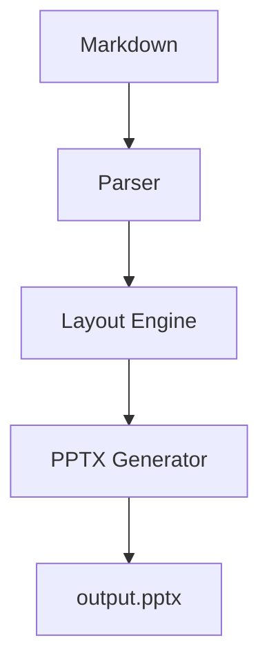

# marhup デモ [title]

グリッドベースレイアウトで PowerPoint を生成 [contents] {.center}

2026年1月 [footer] {.center .small}

---

# 基本的な使い方 [1-12, 1]

[1-6, 2-8]
## シンプルな記法
- Markdown をそのまま記述
- グリッド位置は `[列, 行]` で指定
- 省略すれば自動配置

[7-12, 2-8]
## 主な機能
- 12×9 グリッドシステム
- スタイルクラス指定
- 画像・表のサポート
- テーマカスタマイズ

---

# 2カラムレイアウト [1-12, 1]

[contents_left] {.card .blue}
### 課題
- 手作業による入力ミス
- 処理に時間がかかる
- 属人化している

[contents_right] {.card .green}
### 解決策
- 自動バリデーション
- バッチ処理
- マニュアル整備

[contents]
| 項目 | Before | After |
|------|--------|-------|
| 処理時間 | 3時間 | 10分 |
| エラー率 | 5% | 0.1% |
| コスト | 100万円 | 30万円 |

---

# まとめ [title]

[contents]
## marhup の特徴

1. **直感的なグリッド指定** - `[1-6, 2-8]` 形式で簡単レイアウト
2. **Markdown互換** - 既存のMarkdown知識がそのまま使える
3. **自動配置** - 位置指定を省略すれば自動でレイアウト
4. **スタイルクラス** - `{.center .blue}` で見た目をカスタマイズ

[footer]
詳細は README.md を参照 {.footer .center}

---

# 画像の配置例（縦長画像） [title]

[contents_left]

[contents_right]
## 縦長画像の特徴
- 縦横比 2:1
- 左側に大きく配置
- テキストは右側に

[contents_right]
### 用途
- ポートレート写真
- スマホのスクリーンショット
- 縦向きチャート

---

# 画像の配置例（横長画像） [title]

[contents]

[contents]
## 横長画像の特徴
- 縦横比 1:2
- 全幅で配置すると迫力が出る
- 下にキャプションやテキストを配置

---

# カスタムクラスの例 [title]

[contents_left] {.myclass}
### カスタムスタイル
この要素はカスタムクラス `myclass` を使用しています。

[contents_right] {.another}
### 別のカスタムスタイル
こちらは `another` クラスです。

[contents]
カスタムクラスはFront Matterで定義できます。色、フォントサイズ、装飾などを自由に設定可能です。

[contents_left]

[contents_right]
## フローチャート
- Mermaid記法で図を描画
- 自動的に画像に変換
- PowerPointに埋め込み

[contents_right]
### 対応図形
- flowchart / graph
- sequence diagram
- class diagram
- 他多数
